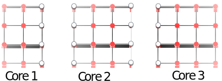

# Heat equation

- Partial differential equation that describes the variation of
  temperature in a given region over time 

$$\frac{\partial u}{\partial t} = \alpha \nabla^2 u$$

- Temperature variation: $u(x, y, z, t)$
- Thermal diffusivity constant: $\alpha$

 {.center width=60%}

# Numerical solution

- Discretize: Finite difference Laplacian in two dimensions

 <small>
 $$\nabla^2 u \rightarrow \frac{u(i-1,j)-2u(i,j)+u(i+1,j)}{(\Delta x)^2}
  + \frac{u(i,j-1)-2u(i,j)+u(i,j+1)}{(\Delta y)^2} $$
</small>
Temperature field $u(i,j)$

 {.center width=45%}

# Time evolution

- Explicit time evolution with time step Δt

$$u^{m+1}(i,j) = u^m(i,j) + \Delta t \alpha \nabla^2 u^m(i,j)$$

- Note: algorithm is stable only when

$$\Delta t < \frac{1}{2 \alpha} \frac{(\Delta x \Delta y)^2}{(\Delta x)^2
(\Delta y)^2}$$

- Given the initial condition ($u(t=0) = u^0$) one can follow the time
  evolution of the temperature field 

# Solving heat equation in parallel

- Temperature at each grid point can be updated independently
- Domain decomposition

 {.center width=60%}
 
- Straightforward in shared memory computer

# Solving heat equation in parallel

- In distributed memory computers, each core can access only its own memory

- Information about neighbouring domains is stored in ”ghost layers”

 {.center width=50%}

- Before each update cycle, CPU cores communicate boundary data: halo exchange

# Serial code structure

 {.center width=70%}

# Parallel code structure

 {.center width=70%}
